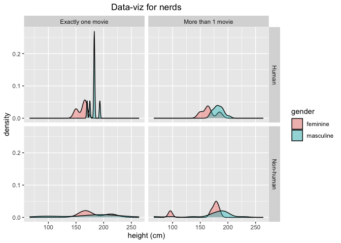

This is my test to say "Hello world", and save it to github using a markdown .md file.


``` r
# some code to run
library(tidyverse)
```

```
## ── Attaching core tidyverse packages ──────────────────────── tidyverse 2.0.0 ──
## ✔ dplyr     1.1.4     ✔ readr     2.1.5
## ✔ forcats   1.0.0     ✔ stringr   1.5.1
## ✔ ggplot2   3.5.1     ✔ tibble    3.2.1
## ✔ lubridate 1.9.3     ✔ tidyr     1.3.1
## ✔ purrr     1.0.2     
## ── Conflicts ────────────────────────────────────────── tidyverse_conflicts() ──
## ✖ dplyr::filter() masks stats::filter()
## ✖ dplyr::lag()    masks stats::lag()
## ℹ Use the conflicted package (<http://conflicted.r-lib.org/>) to force all conflicts to become errors
```

``` r
data(starwars)

# make a cool figure:
starwars %>%
  rowwise() %>%
  mutate(n_films = length(films)) %>%
  mutate(more_1 = case_when(n_films == 1 ~ "Exactly one movie",
                            n_films != 1 ~ "More than 1 movie")) %>%
  mutate(human = case_when(species == "Human" ~ "Human",
                           species != "Human" ~ "Non-human")) %>%
  filter(gender %in% c("feminine", "masculine"), !is.na(human)) %>%
  ggplot(aes(height, fill = gender)) +
  facet_grid(human ~ more_1) +
  ggtitle("Data-viz for nerds") +
  xlab("height (cm)") +
  geom_density(alpha = 0.4) +
  theme(plot.title = element_text(hjust = 0.5))
```

```
## Warning: Removed 6 rows containing non-finite outside the scale range
## (`stat_density()`).
```

<!-- -->

