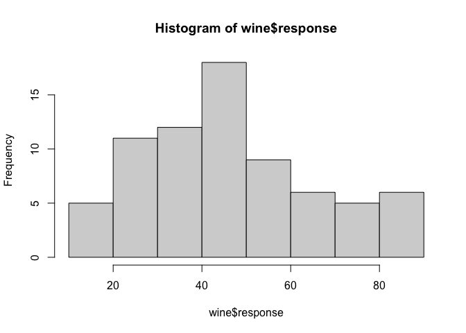
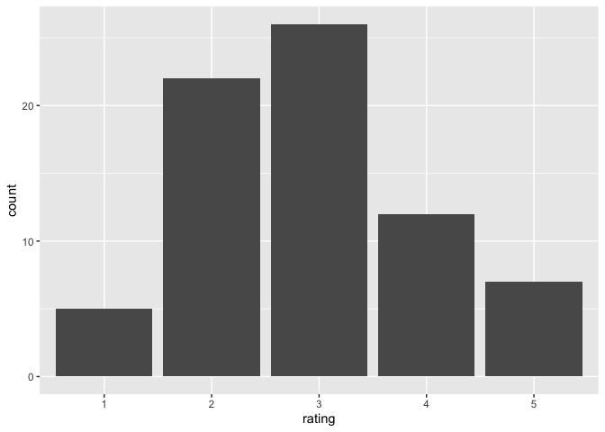
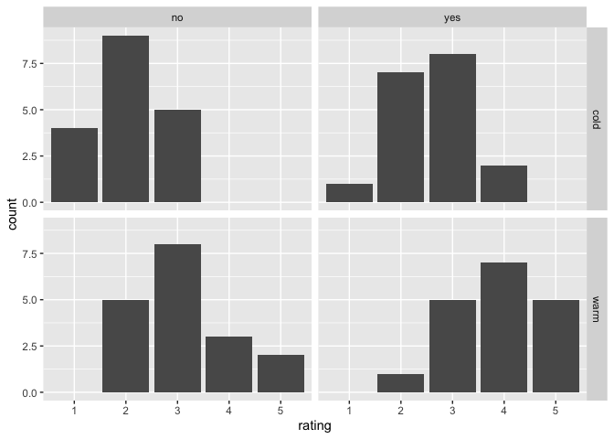
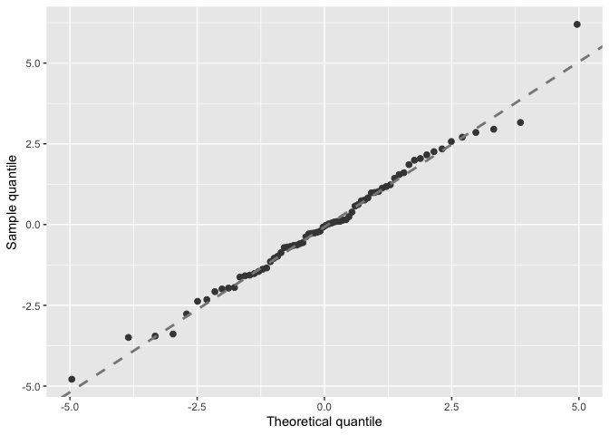
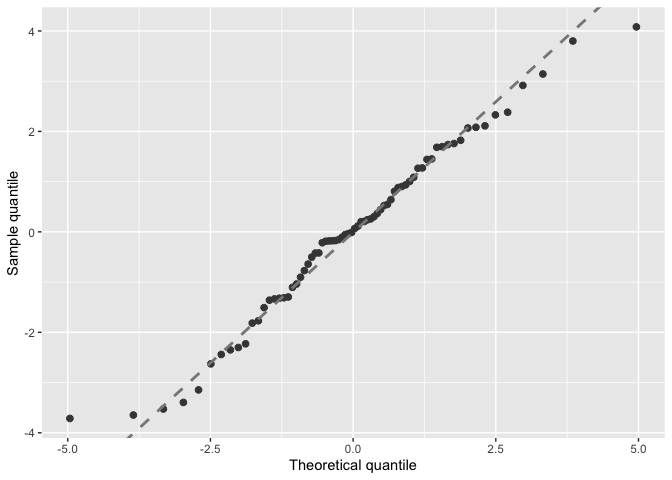
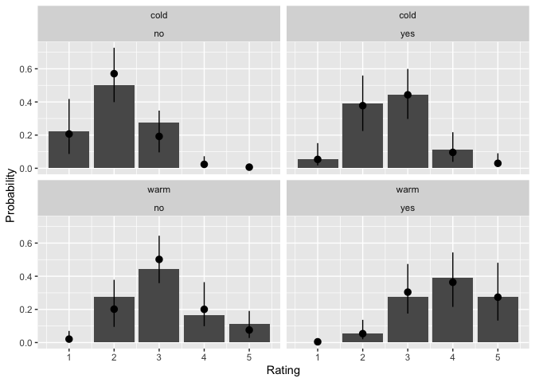

## Learning outcomes

Know how to [build cumulative link ordinal regression models](#clms)  
Know how to [specify nominal effects in cumulative link models](#clmnom)  
Know how to [visualise effects in ordinal regression](#clmvis)  


## Libraries 
In addition to the basic libraries automatically loaded with R, you may wish to use the following additional packages. If necessary, make sure you either have internet access on your machine or that you install these packages prior to the practical.
`{boot}`   
`{sure}`  
`{ordinal}`  
`{reshape2}`  
`{tidyverse}`  


``` r
library(ordinal)
library(sure)
library(reshape2)
library(boot)
library(webexercises)
library(tidyverse)
```


## Ordinal regression
<a name="clms"></a>


As we explained in the lecture, ordinal regression is a special method that is not strictly in the generalised linear models family, but which shares some features with glims. Now that we are somewhat familiar with poisson and binomial models, let's try to run an ordinal regression. We'll use the sample data higlighted as the vignette in the [ordinal package for R](https://cran.r-project.org/package=ordinal), and note that the [published vignette for the package](https://cran.r-project.org/web/packages/ordinal/vignettes/clm_intro.pdf), upon which this material is based, also allows you to incorporate random effects which we'll ignore for today's session to keep things relatively simple (we'll save all discussions of random effects for the sessions on mixed models).

If necessary, install the `{ordinal}` package, and load the library. The data are stored within the ordinal library in an object called `wine`. Call that object and have a look at it. You can also get more information on it using the help documentation to learn about the variables.


``` r
wine
?wine
```

When you're working with ordinal data, one of the key pieces of data management will be to ensure that your response variable (in this case, `rating`) is stored as an ordinal factor. This is true for the wine data by design. 


``` r
# I prefer tibbles
wine <- as_tibble(wine)

str(wine$rating)
```

```
##  Ord.factor w/ 5 levels "1"<"2"<"3"<"4"<..: 2 3 3 4 4 4 5 5 1 2 ...
```

``` r
# make sure factor is ordered
levels(wine$rating)
```

```
## [1] "1" "2" "3" "4" "5"
```

If you were encoding your own data (e.g., Likert scale responses), you can coerce them to an ordered factor, or change the order of factors using the function ordered (here I have commented out the line because we don't actually want to change the order; this is just to explain how it would be done):


``` r
# can change order with 
# wine$rating<-ordered(wine$rating,
                     # levels=c("5", "4", "3",
                              # "2", "1"))
```


Examine a histogram of the continuous `response` variable, which was used to generate ratings. Are you confident that this represents a continuous and normal distribution? Why or why not?

<!-- -->

Examine a bar chart for the ratings (you can use geom_bar for discrete variables), and assess its distribution and whether you think assuming this was a metric (continuous) variable would cause any problems.


``` r
wine %>% 
  ggplot(aes(x = rating))+
  geom_bar()
```

<!-- -->

Now explore the effects of the two predictors on rating, using facetting in ggplot and geom_bar to see how the rating profile changes with both `temp` and `contact`. Note that in this arrangement, the response variable is the frequency (count) of observations of each rating, and the predictors are arranged across panels, so we're interested in assessing whether the distribution of ratings depends on panel.
Can you predict the sign of the coefficients for each of the two predictors? Do you think the effect of one predictor depends on the other one (i.e., is there an interaction)?


``` r
wine %>% 
  ggplot(aes(x = rating))+
  geom_bar()+
  facet_grid(temp ~ contact)
```

<!-- -->

OK, let's build our first ordinal regression model using the `clm()` (for cumulative link model) function from the `{ordinal}` library. The formula syntax should be familiar by now. Include an interaction to start with, and we can test whether it is significant as we proceed.


``` r
bitter.mod1 <- clm(rating ~ temp * contact,
                   data = wine)
```

We need another function, `autoplot.clm` from the `{sure}` package to make a diagnostic plot for our model. This function uses simulations to make a pseudo-qq plot. Because it is simulating, you might want to run it more than once to make sure that the apparent good or bad fit of your model is not the result of a single sampling error. Also, be a bit forgiving for the current dataset, which has a small sample size.


``` r
# diagnostics using the {sure} package
autoplot.clm(bitter.mod1)
```

<!-- -->

If you're satisfied about the fit, let's ask for a summary of the model.


``` r
summary(bitter.mod1)
```

```
## formula: rating ~ temp * contact
## data:    wine
## 
##  link  threshold nobs logLik AIC    niter max.grad cond.H 
##  logit flexible  72   -86.42 186.83 6(0)  5.22e-12 5.1e+01
## 
## Coefficients:
##                     Estimate Std. Error z value Pr(>|z|)    
## tempwarm              2.3212     0.7009   3.311 0.000928 ***
## contactyes            1.3475     0.6604   2.041 0.041300 *  
## tempwarm:contactyes   0.3595     0.9238   0.389 0.697129    
## ---
## Signif. codes:  0 '***' 0.001 '**' 0.01 '*' 0.05 '.' 0.1 ' ' 1
## 
## Threshold coefficients:
##     Estimate Std. Error z value
## 1|2  -1.4113     0.5454  -2.588
## 2|3   1.1436     0.5097   2.244
## 3|4   3.3771     0.6382   5.292
## 4|5   4.9420     0.7509   6.581
```

First examine the upper table of coefficients, and assess whether your intuitions about the main effects and interaction were correct. How did you do? Discuss any discrepancies with classmates or instructors. In the lecture, we will have explained the meaning of the second set of coefficients. Think about what the threshold coefficients mean, and see if you can intuit what the output is telling you about ratings. This is tricky, so don't be too hard on yourself if the meaning is elusive. We recommend the clm vignette, which contains a lot of information, but the reading of which will take time.

The interaction seems not to be contributing, so I would argue it needs to be removed so we can better estimate the main effects. Can you remember how to use the `update()` and `anova()` functions to do this? Give it a go, and use the hint if necessary.


``` r
bitter.mod2<-update(bitter.mod1, ~ . - temp:contact)
anova(bitter.mod2, bitter.mod1, test = "Chi")
```

```
## 'test' argument ignored in anova.clm
```

```
## Likelihood ratio tests of cumulative link models:
##  
##             formula:                link: threshold:
## bitter.mod2 rating ~ temp + contact logit flexible  
## bitter.mod1 rating ~ temp * contact logit flexible  
## 
##             no.par    AIC  logLik LR.stat df Pr(>Chisq)
## bitter.mod2      6 184.98 -86.492                      
## bitter.mod1      7 186.83 -86.416  0.1514  1     0.6972
```


You should be satisfied that the interaction is not needed. Examine the diagnostics for the simplified model, and its summary as well. Do you think further simplification is warranted?


``` r
autoplot.clm(bitter.mod2)
```

<!-- -->

``` r
summary(bitter.mod2)
```

```
## formula: rating ~ temp + contact
## data:    wine
## 
##  link  threshold nobs logLik AIC    niter max.grad cond.H 
##  logit flexible  72   -86.49 184.98 6(0)  4.02e-12 2.7e+01
## 
## Coefficients:
##            Estimate Std. Error z value Pr(>|z|)    
## tempwarm     2.5031     0.5287   4.735 2.19e-06 ***
## contactyes   1.5278     0.4766   3.205  0.00135 ** 
## ---
## Signif. codes:  0 '***' 0.001 '**' 0.01 '*' 0.05 '.' 0.1 ' ' 1
## 
## Threshold coefficients:
##     Estimate Std. Error z value
## 1|2  -1.3444     0.5171  -2.600
## 2|3   1.2508     0.4379   2.857
## 3|4   3.4669     0.5978   5.800
## 4|5   5.0064     0.7309   6.850
```


### Structured thresholds
<a name="clmnom"></a>


The model we built above assumes that the thresholds between rating levels are the same for all levels of the predictor variables. We can relax this assumption and fit so-called "nominal effects" for one of the predictors, and see if it improves the model using likelihood ratio tests, as follows. Have a look at the new model object, and notice the change in the number of coefficients. 


``` r
bitter.mod2.nom_con <- clm(rating ~ temp,
                           nominal = ~ contact,
                           data = wine)
summary(bitter.mod2.nom_con)
```

```
## formula: rating ~ temp
## nominal: ~contact
## data:    wine
## 
##  link  threshold nobs logLik AIC    niter max.grad cond.H 
##  logit flexible  72   -86.21 190.42 6(0)  1.64e-10 4.8e+01
## 
## Coefficients:
##          Estimate Std. Error z value Pr(>|z|)    
## tempwarm    2.519      0.535   4.708  2.5e-06 ***
## ---
## Signif. codes:  0 '***' 0.001 '**' 0.01 '*' 0.05 '.' 0.1 ' ' 1
## 
## Threshold coefficients:
##                 Estimate Std. Error z value
## 1|2.(Intercept)  -1.3230     0.5623  -2.353
## 2|3.(Intercept)   1.2464     0.4748   2.625
## 3|4.(Intercept)   3.5500     0.6560   5.411
## 4|5.(Intercept)   4.6602     0.8604   5.416
## 1|2.contactyes   -1.6151     1.1618  -1.390
## 2|3.contactyes   -1.5116     0.5906  -2.559
## 3|4.contactyes   -1.6748     0.6488  -2.581
## 4|5.contactyes   -1.0506     0.8965  -1.172
```

``` r
anova(bitter.mod2, bitter.mod2.nom_con, test="Chi")
```

```
## 'test' argument ignored in anova.clm
```

```
## Likelihood ratio tests of cumulative link models:
##  
##                     formula:                nominal: link: threshold:
## bitter.mod2         rating ~ temp + contact ~1       logit flexible  
## bitter.mod2.nom_con rating ~ temp           ~contact logit flexible  
## 
##                     no.par    AIC  logLik LR.stat df Pr(>Chisq)
## bitter.mod2              6 184.98 -86.492                      
## bitter.mod2.nom_con      9 190.42 -86.209  0.5667  3      0.904
```

Unfortunately, perhaps because of the small sample, we can't model the inverse object, in which `temp` is the nominal effect. The following model specification raises a warning that the model fails to converge, and the summary reveals that no parameters have been estimated. If this were your data, you would have to stage another wine tasting at least to explore whether temperature has a nominal effect!


``` r
bitter.mod2.nom_temp <- clm(rating ~ contact,
                            nominal = ~ temp,
                            data = wine)
```

```
## Warning: (1) Hessian is numerically singular: parameters are not uniquely determined 
## In addition: Absolute convergence criterion was met, but relative criterion was not met
```

``` r
summary(bitter.mod2.nom_temp)
```

```
## formula: rating ~ contact
## nominal: ~temp
## data:    wine
## 
##  link  threshold nobs logLik AIC    niter max.grad cond.H 
##  logit flexible  72   -84.90 187.81 20(0) 4.35e-09 4.2e+10
## 
## Coefficients:
##            Estimate Std. Error z value Pr(>|z|)
## contactyes    1.465         NA      NA       NA
## 
## Threshold coefficients:
##                 Estimate Std. Error z value
## 1|2.(Intercept)   -1.266         NA      NA
## 2|3.(Intercept)    1.104         NA      NA
## 3|4.(Intercept)    3.766         NA      NA
## 4|5.(Intercept)   24.896         NA      NA
## 1|2.tempwarm     -21.095         NA      NA
## 2|3.tempwarm      -2.153         NA      NA
## 3|4.tempwarm      -2.873         NA      NA
## 4|5.tempwarm     -22.550         NA      NA
```

Because the likelihood ratio test for the one nominal model we can run is NS, we can be satisfied that our model meets the "proportional odds" assumption, and is minimal-adequate. 

The ordinal vignette and the internet both suggest that likelihood ratio tests provide more accurate p-values than the Wald tests provided by default. We consequently recommend a series of simplification steps to generate p-values.


``` r
bitter.modtemptest <- update(bitter.mod2, 
                             ~ . - temp)
anova(bitter.mod2, bitter.modtemptest, test = "Chi")
```

```
## 'test' argument ignored in anova.clm
```

```
## Likelihood ratio tests of cumulative link models:
##  
##                    formula:                link: threshold:
## bitter.modtemptest rating ~ contact        logit flexible  
## bitter.mod2        rating ~ temp + contact logit flexible  
## 
##                    no.par    AIC  logLik LR.stat df Pr(>Chisq)    
## bitter.modtemptest      5 209.91 -99.956                          
## bitter.mod2             6 184.98 -86.492  26.928  1  2.112e-07 ***
## ---
## Signif. codes:  0 '***' 0.001 '**' 0.01 '*' 0.05 '.' 0.1 ' ' 1
```

``` r
bitter.modcontacttest <- update(bitter.mod2,
                                ~ . - contact)
anova(bitter.mod2, bitter.modcontacttest, 
      test = "Chi")
```

```
## 'test' argument ignored in anova.clm
```

```
## Likelihood ratio tests of cumulative link models:
##  
##                       formula:                link: threshold:
## bitter.modcontacttest rating ~ temp           logit flexible  
## bitter.mod2           rating ~ temp + contact logit flexible  
## 
##                       no.par    AIC  logLik LR.stat df Pr(>Chisq)    
## bitter.modcontacttest      5 194.03 -92.013                          
## bitter.mod2                6 184.98 -86.492  11.043  1  0.0008902 ***
## ---
## Signif. codes:  0 '***' 0.001 '**' 0.01 '*' 0.05 '.' 0.1 ' ' 1
```


### Visualising ordinal regression models
<a name="clmvis"></a>


OK, to properly make sense of our model, lets generate and plot predictions, using the infamous `predict()` function. First, generate a new dataframe containing all possible levels of temp and contact, e.g., using the `crossing()` function:


``` r
newwine <- crossing(temp = c("warm", "cold"),
                    contact = c("no", "yes"))
```

We'll pass the model, the new data, and two extra arguments (one specifying that we want confidence limits as well as fits, and the other asking for predicted values as probabilities, to save us the trouble of back-transformation) to `predict()`. Examine the saved predictions object once you have created it.


``` r
wine_preds <- predict(bitter.mod2,
                      newdata=newwine,
                      interval=TRUE, 
                      type="prob")
wine_preds
```

```
## $fit
##             1          2         3          4          5
## 1 0.206790132 0.57064970 0.1922909 0.02361882 0.00665041
## 2 0.053546010 0.37764614 0.4430599 0.09582084 0.02992711
## 3 0.020887709 0.20141572 0.5015755 0.20049402 0.07562701
## 4 0.004608274 0.05380128 0.3042099 0.36359581 0.27378469
## 
## $lwr
##             1          2          3           4           5
## 1 0.086441084 0.39887109 0.09609419 0.007429029 0.001595527
## 2 0.017580298 0.22483820 0.29746543 0.038876765 0.009475544
## 3 0.005989787 0.09458859 0.35857236 0.098866040 0.027585992
## 4 0.001026538 0.01994752 0.17506663 0.215126732 0.132874005
## 
## $upr
##            1         2         3          4          5
## 1 0.41802603 0.7269447 0.3477399 0.07251284 0.02728234
## 2 0.15172666 0.5593657 0.5991420 0.21731390 0.09048786
## 3 0.07022233 0.3784608 0.6443214 0.36435050 0.19090648
## 4 0.02043158 0.1370739 0.4738928 0.54356745 0.48120233
```

The prediction object contains a lot of useful information in an inconvenient form: it's a 3D matrix, with the "rows" 1-4 representing the unique combinations of `temp` and `contact`, the "columns" 1-5 representing the rating categories, and the contents themselves representing the predicted probabilities. We'll need to reshape these data to plot them. If you're feeling brave, have a crack at this yourself. If you're tired (it's late Thursday, and we've learned a lot this week, so you're entitled!), just cheat by looking at my code below:


``` r
# Alternative coding 2023
wine_preds_long<- wine_preds %>% 
  melt(.) %>% 
  rename(Rating = Var2,
         PredComb = Var1) %>% 
  pivot_wider(names_from = L1,
              values_from = value)

newwine <- newwine %>% 
  mutate(PredComb = 1:4)

df_new_wine_preds <- left_join(wine_preds_long, newwine)
```

```
## Joining with `by = join_by(PredComb)`
```


Finally, we're in a position to plot things. As usual, I suggest plotting both data and predictions. Since the predictions are probabilities, we need to convert the data to proportions so they are comparable. The `geom_bar()` function below is modified to present proportions, and each of these is multiplied by four so that it represents the proportion within each of the four combinations of temp and contact. A bit of a fudge, but it works!
  

``` r
# get proportions in raw data
wine_sum <- wine %>% 
  group_by(temp, contact, rating) %>% 
  summarise(count = n()) %>% 
  mutate(prop = count /sum(count)) %>% 
  mutate(rating = as.double(rating))
```

```
## `summarise()` has grouped output by 'temp', 'contact'. You can override using
## the `.groups` argument.
```

``` r
# make a plot
df_new_wine_preds %>% 
  ggplot(aes(x = Rating, y = fit)) +
  geom_bar(data = wine_sum,
           aes(x = rating,
               y =  prop),
           stat = "identity") +
  geom_pointrange(aes(ymin = lwr,
                      ymax = upr)) +
  facet_wrap(temp ~ contact) +
  labs(x = "Rating",
       y = "Probability")
```

<!-- -->

Note that this visualisation has raw data as bars, and the cells and error bars represent model fits (this will be worth explaining at length to readers, since it is somewhat non-intuitive).

CLMs are sufficiently complicated that I didn't feel like I understood this one until the predictions were properly plotted. Spend some time studying your plot, and comparing it to the table of coefficients. Feel free to exponentiate the coefficients (which are in log units) so that you can relate them to your figure. Finally, discuss with your classmates and instructors the costs and benefits of ordinal regression relative to simpler methods that might be easier for your audience to interpret.
  


